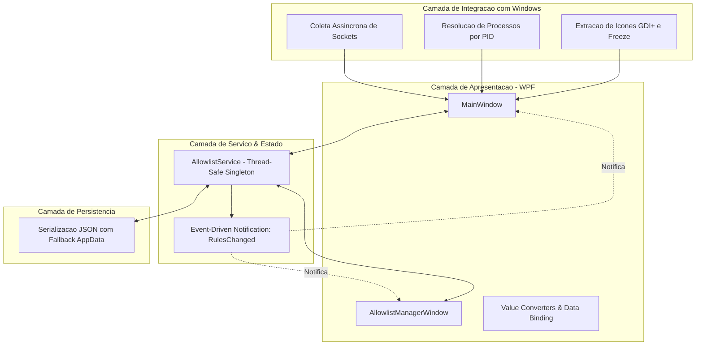
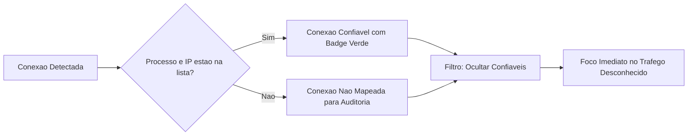

# NetStatAnalyzer

<div align="center">

[](LICENSE)
[](https://dotnet.microsoft.com/download/dotnet/8.0)
[-0078D6?logo=windows&logoColor=white)](https://microsoft.com/windows)
[](https://github.com/muriloai/NetStatAnalyzer/releases)
[](#)

<br/>

**NetStatAnalyzer** e uma ferramenta moderna, leve, rapida e eficiente para Windows que permite visualizar, filtrar e monitorar em tempo real todas as conexoes de rede ativas (TCP e UDP), identificando os processos, icones e caminhos executaveis associados.

<br/>


</div>

---

## Tabela de Conteudos

- [Visao Geral](#visao-geral)
- [Arquitetura e Engenharia de Software](#arquitetura-e-engenharia-de-software)
- [Recursos Principais](#recursos-principais-v110)
- [Sistema de Conexoes Confiaveis](#sistema-de-conexoes-confiaveis)
- [Navegacao e Atalhos de Produtividade](#navegacao-e-atalhos-de-produtividade)
- [Formatos de Exportacao](#formatos-de-exportacao)
- [Requisitos do Sistema](#requisitos-do-sistema)
- [Compilacao e Publicacao](#compilacao-e-publicacao-portatil)
- [Estrutura do Projeto](#estrutura-do-projeto)
- [Licenca](#licenca)

---

## Visao Geral

Diferente do utilitario netstat tradicional de linha de comando ou de ferramentas legadas, o NetStatAnalyzer foi projetado para atender analistas de seguranca, administradores de infraestrutura e desenvolvedores.

O objetivo do projeto e entregar visibilidade instantanea sobre o estado da rede local com foco em:
- Mapeamento visual e imediato entre portas de comunicacao e processos do sistema operacional.
- Triagem agil de conexoes anomalas por meio de regras de associacao estrita entre processo e endereco IP.
- Execucao assincrona de baixo consumo de memoria e sem bloqueio de interface grafica.

---

## Arquitetura e Engenharia de Software

O NetStatAnalyzer foi desenvolvido com C# 12 e .NET 8 no ecossistema WPF, aplicando boas praticas de engenharia de software, separacao de responsabilidades e foco em alta performance em ambiente Windows.



### Destaques Tecnicos da Implementacao

#### 1. Concorrencia e Gerenciamento de Threads
- **Processamento Assincrono sem Bloqueio:** A coleta e o parseamento dos sockets de rede ocorrem em threads em background via tarefas assincronas. A thread principal de interface (UI Thread) permanece livre para interacoes do usuario.
- **Sincronizacao de Recursos Compartilhados:** O servico de regras utiliza bloqueios refinados para leitura e escrita, garantindo consistencia de dados durante modificacoes concorrentes.
- **Renderizacao Segura de Imagens:** Os icones dos executaveis sao extraidos via GDI+, convertidos em objetos de bitmap e congelados em memoria (Freeze). Isso permite que recursos criados em threads secundarias sejam consumidos pela interface sem violacao de thread affinity.

#### 2. Padroes de Projeto e Desacoplamento
- **Singleton com Inicializacao Tardia:** O servico central de regras e mantido por uma instancia unica instanciada sob demanda de forma segura.
- **Comunicacao Orientada a Eventos:** Mudancas na base de regras disparam eventos que sincronizam telas ativas simultaneamente sem necessidade de acoplamento direto entre as janelas.
- **Data Binding Reativo:** A tabela principal e alimentada por colecoes observaveis integradas ao motor de template e conversores de valor do WPF, garantindo atualizacoes automaticas de badges e filtros.

#### 3. Resiliencia e Persistencia com Fallback
- **Estrategia de Gravacao Tolerante a Falhas:** A aplicacao tenta gravar os arquivos de configuracao no diretorio local do executavel. Caso o usuario execute a aplicacao a partir de uma pasta protegida sem permissao de escrita (como Program Files), o servico redireciona o armazenamento para a pasta AppData do usuario de forma transparente.
- **Schema JSON Versionado:** As exportacoes de regras incluem metadados de aplicacao, versao e data de emissao, facilitando a interoperabilidade entre diferentes instalacoes.

---

## Recursos Principais (v1.1.0)

- **Monitoramento Ativo em Tempo Real:** Captura conexoes TCP e UDP ativas, portas locais e remotas com atualizacao rapida e assincrona.
- **Identificacao Visual de Processos:** Identifica o icone do executavel, PID, nome do processo e o caminho absoluto em disco.
- **Badges de Estado Coloridos:** Categorizacao visual imediata para estados como ESTABLISHED, LISTENING, TIME_WAIT, CLOSE_WAIT, SYN_SENT e SYN_RECEIVED.
- **Painel Superior de Metricas:** Indicadores instantaneos com a contagem de conexoes Totais, Estabelecidas, Em Escuta e Confiaveis.
- **Busca Global Instantanea:** Filtro em tempo real por nome do programa, PID, endereco IP de origem ou destino, porta e protocolo.
- **Selecao Multipla por Blocos:** Suporte nativo a intervalos continuos com Shift + Clique e blocos descontinuos com Ctrl + Clique para operacoes em lote.
- **Integracao com o Windows Explorer:** Acesso direto a pasta do executavel com duplo clique na linha ou atraves do menu de contexto.

---

## Sistema de Conexoes Confiaveis

O aplicativo possui uma solucao integrada de lista de confianca baseada na associacao estrita entre o nome do processo e o endereco IP remoto ou local.



### Funcionamento do Mecanismo de Confianca
1. **Validacao Estrita:** A regra exige que tanto o processo quanto o endereco IP correspondam aos registros confiaveis, evitando que softwares desconhecidos herdem permissoes indevidas.
2. **Filtro em 3 Modos:** Permite alternar entre visualizar todas as conexoes, apenas as conexoes confiaveis ou ocultar as conhecidas para focar exclusivamente no trafego nao reconhecido.
3. **Gerenciador de Regras Dedicado:** Janela propria para consultar regras cadastradas, remover itens individuais, limpar o banco de dados, importar e exportar arquivos JSON.

---

## Navegacao e Atalhos de Produtividade

| Acao ou Atalho | Comportamento |
| :--- | :--- |
| **Clique Simples** | Seleciona uma linha individual |
| **Shift + Clique** | Seleciona um intervalo continuo de linhas para cima ou para baixo |
| **Ctrl + Clique** | Adiciona ou remove linhas especificas da selecao atual |
| **Ctrl + Shift + Clique** | Estende a selecao em multiplos blocos preservando os anteriores |
| **Duplo Clique na Linha** | Abre o local do arquivo no Windows Explorer |
| **Botao Direito** | Abre o menu de contexto com opcoes de copia, marcacao e exportacao |
| **F5 ou Botao Recarregar** | Recarrega as conexoes de forma assincrona sem travar a interface |

---

## Formatos de Exportacao

E possivel exportar todas as conexoes listadas ou filtradas na tabela principal com apenas um clique:

- **JSON (.json):** Estrutura completa de dados formatada para integracoes, automacoes e ferramentas de seguranca.
- **CSV (.csv):** Formato compativel com Microsoft Excel, Power BI e Google Sheets para analise em planilhas.
- **Relatorio TXT (.txt):** Documento formatado em colunas alinhadas com cabecalho, resumo de metricas e horario da coleta.

---

## Requisitos do Sistema

- **Sistema Operacional:** Windows 10 (versao 19041 ou superior) ou Windows 11 (64-bit)
- **Runtime:** .NET 8.0 Desktop Runtime (apenas caso nao utilize o executavel portatil autocontido)
- **Privilegios:** Recomendado executar como Administrador para resolver caminhos e icones de processos de sistema protegidos.

---

## Compilacao e Publicacao Portatil

A compilacao e geracao dos binarios pode ser feita via terminal com o SDK do .NET 8:

### 1. Versao Portatil Autocontida (Self-Contained)
Gera um unico arquivo executavel com todo o runtime do .NET 8 embutido e compactado, dispensando qualquer instalacao previa na maquina do usuario:

```powershell
dotnet publish NetStatAnalyzer.csproj -c Release -r win-x64 --self-contained true -p:PublishSingleFile=true -p:EnableCompressionInSingleFile=true -p:IncludeNativeLibrariesForSelfExtract=true -o ./dist
```
> **Executavel gerado:** `./dist/NetStatAnalyzer.exe`

### 2. Versao Dependente do Framework
Gera um executavel reduzido de aproximadamente 2 MB, recomendado para computadores que ja possuem o .NET 8 Desktop Runtime instalado:

```powershell
dotnet publish NetStatAnalyzer.csproj -c Release -r win-x64 --self-contained false -p:PublishSingleFile=true -o ./publish
```
> **Executavel gerado:** `./publish/NetStatAnalyzer.exe`

---

## Estrutura do Projeto

```text
NetStatAnalyzer/
├── assets/
│   ├── icon.ico                 # Icone do aplicativo para Windows
│   ├── icon.png                 # Logotipo em alta resolucao
│   ├── icon-dark.ico            # Icone variante para temas escuros
│   └── icon-dark.png            # Logotipo variante
├── AllowlistManagerWindow.xaml  # Interface da janela de gerenciamento de regras
├── AllowlistManagerWindow.xaml.cs
├── AllowlistModel.cs            # Modelos de dados e contratos de serializacao
├── AllowlistService.cs          # Servico thread-safe de persistencia e consulta
├── App.xaml                     # Configuracao global da aplicacao WPF
├── App.xaml.cs
├── AssemblyInfo.cs              # Metadados do assembly
├── Converters.cs                # Conversores de dados para visualizacao XAML
├── MainWindow.xaml              # Janela principal do monitor de conexoes
├── MainWindow.xaml.cs           # Logica assincrona, parsing de rede e filtros
├── NetStatAnalyzer.csproj       # Configuracao de build e publicacao .NET 8
└── LICENSE                      # Licenca MIT
```

---

## Licenca

Este projeto e distribuido sob os termos da licenca [MIT](LICENSE). Consulte o arquivo para obter todos os detalhes.


