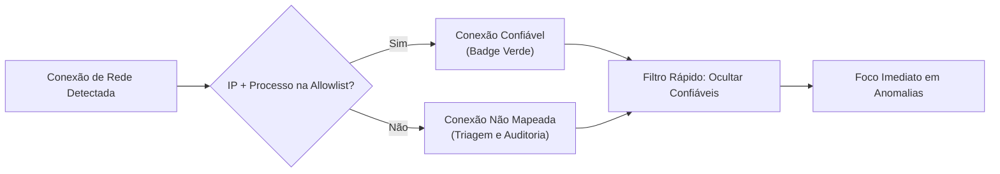

# NetStatAnalyzer

<div align="center">

[](LICENSE)
[](https://dotnet.microsoft.com/download/dotnet/8.0)
[-0078D6?logo=windows&logoColor=white)](https://microsoft.com/windows)
[](https://github.com/muriloai/NetStatAnalyzer/releases)
[](#)

<br/>

**NetStatAnalyzer** é uma ferramenta moderna, leve, rápida e eficiente para Windows que permite visualizar, filtrar e monitorar em tempo real todas as conexões de rede ativas (TCP/UDP), identificando instantaneamente os processos, ícones e executáveis associados.

<br/>


</div>

---

## Tabela de Conteúdos

- [Visão Geral](#visão-geral)
- [Recursos Principais](#recursos-principais-v110)
- [Sistema de Conexões Confiáveis](#sistema-inteligente-de-conexões-confiáveis)
- [Navegação e Atalhos de Produtividade](#navegação-e-atalhos-de-produtividade)
- [Formatos de Exportação](#formatos-de-exportação)
- [Requisitos do Sistema](#requisitos-do-sistema)
- [Compilação e Publicação](#compilação-e-publicação-portátil)
- [Estrutura do Projeto](#estrutura-do-projeto)
- [Licença](#licença)

---

## Visão Geral

Diferente do utilitário `netstat` nativo do terminal ou de ferramentas pesadas, o **NetStatAnalyzer** foi projetado para analistas de segurança, administradores de redes e desenvolvedores que buscam:
- **Visibilidade imediata** das conexões ativas e portas em escuta.
- **Identificação visual precisa** do software responsável pelo tráfego com ícones e caminhos em disco.
- **Triagem eficiente** para detectar conexões desconhecidas, suspeitas ou anômalas através de uma Allowlist inteligente.
- **Execução leve e não-bloqueante**, garantindo uma interface fluida com carregamento e recarregamento assíncrono.

---

## Recursos Principais (v1.1.0)

- **Monitoramento Ativo em Tempo Real:** Coleta e renderiza conexões TCP e UDP ativas, portas locais/remotas e estados com atualização assíncrona sem travamentos de interface.
- **Identificação Visual de Processos:** Extração automática de ícone, PID, nome do executável e caminho completo em disco.
- **Badges de Estado Coloridos:** Categorização cromática intuitiva para estados de conexão:
  - `ESTABLISHED` Conexões ativas e operacionais
  - `LISTENING` Portas abertas aguardando conexões
  - `TIME_WAIT` / `CLOSE_WAIT` Encerramentos e transições de socket
  - `SYN_SENT` / `SYN_RECEIVED` Aberturas de handshake
- **Painel Superior de Métricas:** Estatísticas instantâneas de conexões **Totais**, **Estabelecidas**, **Em Escuta** e **Confiáveis**.
- **Filtro e Busca Global Instantânea:** Pesquisa em tempo real por nome do executável, PID, IP de origem/destino, porta ou protocolo.
- **Seleção Múltipla Avançada por Blocos:** Suporte nativo completo a seleção contínua (`Shift + Clique`) e seleção arbitrária descontínua (`Ctrl + Clique` / `Ctrl + Shift + Clique`) com suporte a ações em lote.
- **Integração com Windows Explorer:** Acesso direto ao executável com duplo clique na linha ou via menu de contexto (*Abrir Local do Arquivo*).

---

## Sistema Inteligente de Conexões Confiáveis

O NetStatAnalyzer inclui um mecanismo robusto de **Allowlist por Associação Estrita (IP + Processo)** para isolar rapidamente o ruído legítimo do sistema e focar em conexões não reconhecidas.



### Funcionalidades do Sistema de Confiança:
1. **Vínculo Estrito:** A regra associa o **Processo** ao **IP correspondente**, evitando que um executável desconhecido se passe por tráfego legítimo.
2. **Filtro Rápido em 3 Modos:**
   - *Todas as Conexões*: Exibe todo o tráfego detectado.
   - *Apenas Confiáveis*: Visualiza apenas regras conhecidas ativas.
   - *Ocultar Confiáveis*: **Modo Auditoria** — Remove todo o tráfego conhecido da tela para focar em conexões não mapeadas.
3. **Persistência Automática:** Salvo automaticamente em `allowlist.json` no diretório da aplicação.
4. **Gerenciador Dedicado (`AllowlistManagerWindow`):**
   - Busca de regras existentes por processo ou IP.
   - Remoção individual ou em lote.
   - Limpeza total com confirmação.
   - **Importação e Exportação JSON** com metadados de versão (`1.1.0`) e timestamps para facilitar o compartilhamento entre computadores ou equipes de SOC/TI.

---

## Navegação e Atalhos de Produtividade

| Ação / Atalho | Comportamento |
| :--- | :--- |
| **Clique Simples** | Seleciona uma linha individual. |
| **Shift + Clique** | Seleciona um intervalo contínuo de linhas (para cima ou para baixo). |
| **Ctrl + Clique** | Adiciona ou remove itens específicos da seleção atual (múltiplos blocos). |
| **Ctrl + Shift + Clique** | Estende a seleção em blocos múltiplos preservando seleções anteriores. |
| **Duplo Clique na Linha** | Abre o diretório do processo com o executável selecionado no Windows Explorer. |
| **Botão Direito (Menu de Contexto)** | Exibe opções de cópia estruturada, marcação de confiança e exportação. |
| **F5 / Botão Recarregar** | Executa recarregamento assíncrono dos dados sem congelar a UI. |

---

## Formatos de Exportação

Exporte o conjunto completo ou a lista filtrada visível na tabela principal com apenas 1 clique:

- **JSON (`.json`):** Estrutura de dados completa para automações, APIs e pipelines de segurança.
- **CSV (`.csv`):** Formato separado por vírgulas pronto para análise em Microsoft Excel, Power BI ou Google Sheets.
- **Relatório TXT (`.txt`):** Relatório tabular legível com cabeçalhos alinhados, contagem de registros e timestamp da captura.

---

## Requisitos do Sistema

- **Sistema Operacional:** Windows 10 (Build 19041+) ou Windows 11 (64-bit)
- **Runtime:** .NET 8.0 Desktop Runtime *(não necessário ao utilizar a versão Self-Contained)*
- **Privilégios:** Recomendado executar como **Administrador** para permitir a resolução de caminhos e ícones de processos protegidos do sistema (ex.: `svchost.exe`, `System`, `csrss.exe`).

---

## Compilação e Publicação Portátil

Você pode compilar e empacotar o projeto utilizando o .NET 8 SDK:

### 1. Versão 100% Portátil (Self-Contained) — *Recomendado para distribuição*
Gera um executável único (`.exe`) com todo o runtime embutido e compactado. Não exige instalação prévia do .NET na máquina de destino:

```powershell
dotnet publish NetStatAnalyzer.csproj -c Release -r win-x64 --self-contained true -p:PublishSingleFile=true -p:EnableCompressionInSingleFile=true -p:IncludeNativeLibrariesForSelfExtract=true -o ./dist
```
> **Executável gerado:** `./dist/NetStatAnalyzer.exe`

### 2. Versão Ultra Compacta (Framework-Dependent)
Gera um executável leve de apenas ~2 MB, ideal para ambientes corporativos ou máquinas que já contam com o .NET 8 Desktop Runtime instalado:

```powershell
dotnet publish NetStatAnalyzer.csproj -c Release -r win-x64 --self-contained false -p:PublishSingleFile=true -o ./publish
```
> **Executável gerado:** `./publish/NetStatAnalyzer.exe`

---

## Estrutura do Projeto

```text
NetStatAnalyzer/
├── assets/
│   ├── icon.ico                 # Ícone do aplicativo para Windows
│   ├── icon.png                 # Logotipo em alta resolução
│   ├── icon-dark.ico            # Ícone variante para temas escuros
│   └── icon-dark.png            # Logotipo variante
├── AllowlistManagerWindow.xaml  # Interface da janela de gerenciamento da Allowlist
├── AllowlistManagerWindow.xaml.cs
├── AllowlistModel.cs            # Estrutura de dados das regras e exportação JSON
├── AllowlistService.cs          # Serviço singleton de persistência e validação
├── App.xaml                     # Configuração global de aplicação e temas WPF
├── App.xaml.cs
├── AssemblyInfo.cs              # Metadados do assembly
├── Converters.cs                # Conversores XAML (visibilidade, cores, badges)
├── MainWindow.xaml              # Janela principal do monitor de conexões
├── MainWindow.xaml.cs           # Lógica assíncrona, comandos, netstat parsing e filtros
├── NetStatAnalyzer.csproj       # Configuração de build e empacotamento .NET 8
└── LICENSE                      # Licença MIT
```

---

## Licença

Este projeto é distribuído sob os termos da licença [MIT](LICENSE). Consulte o arquivo para mais detalhes.


