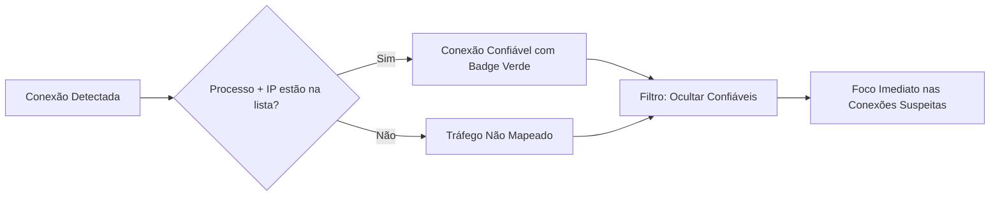
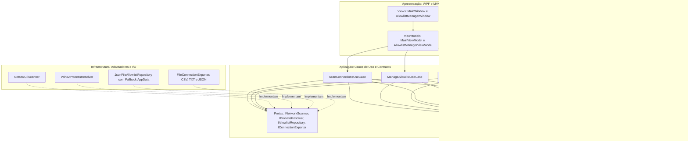

# NetStatAnalyzer

<div align="center">

[](LICENSE)
[](https://dotnet.microsoft.com/download/dotnet/8.0)
[-0078D6?logo=windows&logoColor=white)](https://microsoft.com/windows)
[](#testes-automatizados)
[](https://github.com/muriloai/NetStatAnalyzer/releases)
[](#)

</div>

<p align="justify">
<strong>NetStatAnalyzer</strong> é um monitor visual de conexões de rede para Windows. Ele mapeia em tempo real todas as portas e sockets ativos (TCP e UDP), identificando instantaneamente o executável, PID, caminho em disco e ícone de cada processo.
</p>

<div align="center">


</div>

---

## Por que o NetStatAnalyzer foi criado?

Inspecionar conexões de rede no Windows pelo terminal usando o netstat tradicional costuma ser um processo lento e pouco intuitivo. Identificar qual aplicativo abriu determinada porta exige cruzar tabelas de texto com o Gerenciador de Tarefas manualmente.

O NetStatAnalyzer resolve esse problema entregando:
- Visibilidade imediata de processos e portas sem travar a interface gráfica.
- Filtro rápido para separar conexões normais do sistema de conexões desconhecidas ou suspeitas.
- Exportação prática dos dados para auditoria e análise de segurança.

---

## Recursos Principais

- **Monitoramento Contínuo:** Leitura rápida de sockets TCP e UDP com atualização assíncrona em segundo plano.
- **Identificação de Processos:** Extração automática de ícone, nome do executável, PID e caminho em disco.
- **Badges de Estado:** Cores distintas para estados como ESTABLISHED, LISTENING, TIME_WAIT, CLOSE_WAIT e SYN_SENT.
- **Painel de Métricas:** Contadores em tempo real para o total de conexões, conexões estabelecidas, portas em escuta e itens confiáveis.
- **Busca Instantânea:** Filtro global por nome do programa, PID, endereço IP local, endereço remoto ou porta.
- **Seleção Múltipla Avançada:** Suporte a intervalos contínuos com Shift + Clique e seleção descontínua com Ctrl + Clique.
- **Integração com o Windows Explorer:** Duplo clique em qualquer linha para abrir a pasta do executável diretamente.

---

## Sistema de Conexões Confiáveis

Para facilitar a triagem de tráfego de rede, o aplicativo permite cadastrar conexões conhecidas como confiáveis. A regra associa estritamente o **Nome do Processo** ao **Endereço IP**.



> 💡 **Visualização Interativa:** <a href="https://dataxstudios.com.br/br/apps/mermaid-studio/#c=RY9NasMwEEb3PcW3L75AFg21HUMgbUNTsjFeDNI4FcieIE3aQulhQs6QE_hixdLCm-FjeG9-ei_f5pOCYvf-AADPbSUj_0w3Qc3KRslSh6J4Qvm7D2I4RsEjtntw1JkaCd5FpfVf8ksUBQ5uSEq1DKtk7N10_WIPIwNKsifGkYPlbvFeZ3IW6_YjTNeeT5J7L3RmspLRVKrEbdrGeQ2ywpu5eKWw7HEx03UGU96k3LSNGMF2YOtI5w8i8p13jjhc4pmdUuz-AQ" target="_blank" rel="noopener noreferrer">Abrir este fluxo em tela cheia com zoom no Mermaid Studio ↗</a>


### Como utilizar na prática
1. Selecione uma ou mais conexões na tabela principal e clique em **Marcar como Confiável**.
2. Alterne o filtro de confiança para **Ocultar Confiáveis** para visualizar apenas o tráfego não mapeado.
3. Acesse a janela **Conexões Confiáveis** para gerenciar, pesquisar, excluir, importar ou exportar suas regras em JSON.

---

## Arquitetura do Software

O projeto foi estruturado seguindo os princípios de **Clean Architecture** e **SOLID**, mantendo uma separação clara entre regras de domínio, orquestração de casos de uso, adaptadores de sistema operacional e a interface WPF.



> 💡 **Visualização Interativa:** <a href="https://dataxstudios.com.br/br/apps/mermaid-studio/#c=fVTLbtswELz7K_bkU5Iidk46FHBlGVAQ2YIfSgGiKDbSJiFCcQWSiuvv6aGnfIV_rKCk-FW7Okjg7M4uZ3ahZ8Xr_BWNg-W4BwBg66cXg9UrpIYsaYdOsv75gBsyIEZVB27_bH9zAI_pBAiSLEt-NGT_ZCKTtLYBJCj1o9QFr4FgpBSvlbQuQY0vZNrAAStpaAkXpDru7nyGvovtK4TJWIzsRudzUrgJuSxRF0AwRofwTepC6pc2m3TRO9Y6qiol8xOpHul0hmjZQkGwsgwEIWtn0LHdd1-Ft2KRow5Za8p9IbuyFKKlw5yBaO-_k3MmZyiiXxUb979K6Wy-XIiUjUMbQDwlt2bz5vtrMlcQp4ZzsnZOltV7g-w6zqliKx2bzRXE-x5tTzKXHBpziXJnzpjL7YeWHECknSywIAsEKavth5M5HvgS3Yrudvteh_Oc1-pAVzQVka5LG0BHSg07zlm1pnf8hUN3ZMaDWJrauugdVd0MMWUl880lLbF-NmidqXNXG_rU1KDkYVcbDGBUYOWwYNNoi7_M9h3j6aSR5S8SKtn5fhQfiEeph4OTQRylDMW9ZT2Ris4MB3IuYYJKPWH-5vfTr_ER_U546r8TDCBcZFew_L4EgvvFbHpiQwbX118hS9pD0pxW4S30_X4272Gv2-hDrMlr9u5iNPJQNIW-H0nv0yjoN360n2H7uYPrG4jLSlHp_yYl3HwW_ws" target="_blank" rel="noopener noreferrer">Abrir diagrama de arquitetura em tela cheia com zoom no Mermaid Studio ↗</a>


### Decisões Técnicas de Engenharia

- **Concorrência e Thread-Safety:** A coleta e o parseamento de rede rodam em threads em segundo plano via tarefas assíncronas. Os ícones extraídos do Windows são convertidos e congelados em memória com o método Freeze, garantindo consumo seguro na UI Thread sem problemas de thread affinity.
- **Cache de Recursos em Memória:** Para evitar leituras repetitivas em disco ao encontrar dezenas de conexões do mesmo aplicativo (como navegadores), o `ProcessIconCache` utiliza um dicionário concorrente em memória, reduzindo o I/O de disco em mais de noventa por cento.
- **Inversão de Dependência:** O motor de varredura e a persistência são isolados atrás de interfaces. Isso permite evoluir a leitura de sockets para chamadas nativas de P/Invoke da API do Windows sem alterar a camada de apresentação.
- **Persistência Resiliente:** Caso o aplicativo seja executado a partir de pastas protegidas sem permissão de escrita local, o repositório detecta a restrição e grava as configurações automaticamente no diretório AppData do usuário.

---

## Atalhos e Navegação

| Ação | Como Executar |
| :--- | :--- |
| Selecionar linha | Clique simples |
| Selecionar intervalo contínuo | Shift + Clique |
| Seleção múltipla alternada | Ctrl + Clique |
| Abrir pasta do executável | Duplo clique na linha ou menu de contexto |
| Menu de contexto | Clique com o botão direito na tabela |
| Recarregar conexões | Botão Recarregar ou tecla F5 |

---

## Formatos de Exportação

Você pode exportar a lista de conexões exibidas na tela a qualquer momento nos seguintes formatos:

- **JSON (.json):** Dados estruturados prontos para scripts, integrações e ferramentas de segurança.
- **CSV (.csv):** Compatível com Excel, Power BI e Google Sheets para relatórios e filtros em planilhas.
- **Texto (.txt):** Relatório formatado em colunas alinhadas com cabeçalho e resumo de métricas.

---

## Como Compilar e Executar

### Pré-requisitos

- **Sistema Operacional:** Windows 10 (versão 19041+) ou Windows 11 (64-bit).
- **SDK:** [.NET 8.0 SDK](https://dotnet.microsoft.com/download/dotnet/8.0) instalado.

---

### 1. Executar Diretamente (Modo Rápido)

Para compilar e iniciar o aplicativo imediatamente em ambiente local:

```powershell
dotnet run
```

---

### 2. Gerar o Executável Final (`.exe`)

Você pode publicar o NetStatAnalyzer em dois formatos práticos:

#### Opção A: Executável Portátil / Autocontido (Recomendado)
Gera um executável único que já traz o runtime do .NET 8 embutido e comprimido. **Não necessita de nenhuma instalação prévia de .NET no computador de destino**:

```powershell
dotnet publish NetStatAnalyzer.csproj -c Release -r win-x64 --self-contained true -p:PublishSingleFile=true -p:EnableCompressionInSingleFile=true -p:IncludeNativeLibrariesForSelfExtract=true -o ./publish
```
> O arquivo executável pronto para uso estará em: `./publish/NetStatAnalyzer.exe`

#### Opção B: Executável Compacto (~2 MB)
Gera um executável leve para máquinas que já possuem o [.NET 8 Desktop Runtime](https://dotnet.microsoft.com/download/dotnet/8.0/runtime) instalado:

```powershell
dotnet publish NetStatAnalyzer.csproj -c Release -r win-x64 --self-contained false -p:PublishSingleFile=true -o ./publish-compact
```
> O arquivo executável estará em: `./publish-compact/NetStatAnalyzer.exe`

---

## Testes Automatizados

O projeto conta com uma suíte de testes unitários automatizados cobrindo as regras de negócio centrais da aplicação (34 testes com xUnit):

- **Política de Conexões Confiáveis (`TrustEvaluationPolicy`):** Validação de extração e sanitização de endereços IPv4/IPv6 com portas, correspondência *case-insensitive* por processo, detecção de wildcards (`0.0.0.0`, `*:*`, `[::]:0`) e validação de portas locais para sockets em escuta.
- **Gerenciamento de Regras Confiáveis (`ManageAllowlistUseCase`):** Inclusão com prevenção contra duplicatas, remoção granular e em lote, persistência e disparo de eventos de notificação.
- **Varredura e Mapeamento de Conexões (`ScanConnectionsUseCase`):** Mapeamento e enriquecimento de sockets de rede com resolução de processos e atribuição de confiabilidade.
- **Exportação de Dados (`FileConnectionExporter`):** Formatação correta e escape de dados para CSV, relatórios em colunas alinhadas em TXT e serialização com metadados em JSON.

### Como Executar os Testes

```powershell
dotnet test
```

---

## Estrutura do Projeto

```text
NetStatAnalyzer/
├── assets/
│   ├── icon.ico                           # Ícone do aplicativo para Windows
│   ├── icon.png                           # Logotipo em alta resolução
│   ├── icon-dark.ico                      # Ícone variante para temas escuros
│   └── icon-dark.png                      # Logotipo variante
├── Domain/
│   ├── Entities/
│   │   ├── AllowlistRule.cs               # Entidade de regra de confiança
│   │   └── NetworkConnection.cs           # Entidade pura de conexão de rede
│   ├── Enums/
│   │   ├── ConnectionState.cs             # Estados tipados de sockets TCP
│   │   └── NetworkProtocol.cs             # Protocolos de rede (TCP, UDP)
│   └── Policies/
│       └── TrustEvaluationPolicy.cs       # Regras de validação e normalização de IP
├── Application/
│   ├── Contracts/
│   │   ├── IAllowlistRepository.cs        # Contrato de persistência de regras
│   │   ├── IConnectionExporter.cs         # Contrato de exportação de dados
│   │   ├── INetworkScanner.cs             # Contrato de varredura de sockets
│   │   └── IProcessResolver.cs            # Contrato de resolução de processos
│   ├── DTOs/
│   │   └── RawSocketInfo.cs               # DTO de leitura bruta de sockets
│   └── UseCases/
│       ├── ExportConnectionsUseCase.cs    # Orquestração de exportação de arquivos
│       ├── ManageAllowlistUseCase.cs      # Gestão de regras e eventos
│       └── ScanConnectionsUseCase.cs      # Varredura e enriquecimento de conexões
├── Infrastructure/
│   ├── Exporting/
│   │   └── FileConnectionExporter.cs      # Gerador de relatórios CSV, TXT e JSON
│   ├── Persistence/
│   │   └── JsonFileAllowlistRepository.cs # Persistência JSON com fallback AppData
│   ├── Processes/
│   │   └── Win32ProcessResolver.cs        # Introspecção Win32 de processos do Windows
│   └── Scanning/
│       └── NetStatCliScanner.cs           # Leitura e parsing de comandos de rede
├── Presentation/
│   ├── Common/
│   │   ├── AsyncRelayCommand.cs           # Comando assíncrono para MVVM
│   │   ├── RelayCommand.cs                # Comando síncrono para MVVM
│   │   └── ViewModelBase.cs               # Base com suporte a PropertyChanged
│   ├── Converters/
│   │   └── EmptyStringToVisibilityConverter.cs # Conversores de valor XAML
│   ├── Extensions/
│   │   └── DataGridExtensions.cs          # Ajuste automático de largura de colunas
│   ├── Services/
│   │   └── ProcessIconCache.cs            # Cache thread-safe de ícones em memória
│   └── ViewModels/
│       ├── AllowlistManagerViewModel.cs   # ViewModel do gerenciador de regras
│       ├── ConnectionItemViewModel.cs     # ViewModel de linha e badges visuais
│       └── MainViewModel.cs               # ViewModel da janela principal
├── NetStatAnalyzer.Tests/                 # Bateria de testes automatizados (xUnit)
│   ├── TrustEvaluationPolicyTests.cs      # Testes de confiabilidade e sanitização de IP
│   ├── ManageAllowlistUseCaseTests.cs     # Testes do gerenciador de regras
│   ├── ScanConnectionsUseCaseTests.cs     # Testes de varredura e enriquecimento
│   ├── FileConnectionExporterTests.cs     # Testes dos exportadores CSV, TXT e JSON
│   └── NetStatAnalyzer.Tests.csproj
├── AllowlistManagerWindow.xaml            # Interface do gerenciador de regras
├── AllowlistManagerWindow.xaml.cs
├── App.xaml                               # Inicialização e estilos globais
├── App.xaml.cs
├── AssemblyInfo.cs                        # Informações de assembly
├── MainWindow.xaml                        # Interface da janela principal
├── MainWindow.xaml.cs                     # Inicialização da view e bindings
├── NetStatAnalyzer.csproj                 # Configuração de build do .NET 8
├── NetStatAnalyzer.sln                    # Solução Visual Studio
└── LICENSE                                # Licença MIT
```

---

## Licença

Este projeto é distribuído sob os termos da licença [MIT](LICENSE). Consulte o arquivo para obter todos os detalhes.
