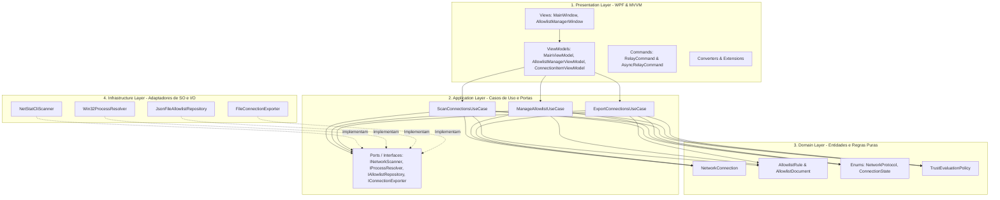

# NetStatAnalyzer

<div align="center">

[](LICENSE)
[](https://dotnet.microsoft.com/download/dotnet/8.0)
[-0078D6?logo=windows&logoColor=white)](https://microsoft.com/windows)
[](https://github.com/muriloai/NetStatAnalyzer/releases)
[](#)

<br/>

**NetStatAnalyzer** é uma ferramenta moderna, leve, rápida e eficiente para Windows que permite visualizar, filtrar e monitorar em tempo real todas as conexões de rede ativas (TCP e UDP), identificando os processos, ícones e caminhos executáveis associados.

<br/>


</div>

---

## Tabela de Conteúdos

- [Visão Geral](#visão-geral)
- [Arquitetura e Engenharia de Software](#arquitetura-e-engenharia-de-software)
- [Recursos Principais](#recursos-principais-v110)
- [Sistema de Conexões Confiáveis](#sistema-de-conexões-confiáveis)
- [Navegação e Atalhos de Produtividade](#navegação-e-atalhos-de-produtividade)
- [Formatos de Exportação](#formatos-de-exportação)
- [Requisitos do Sistema](#requisitos-do-sistema)
- [Compilação e Publicação](#compilação-e-publicação-portátil)
- [Estrutura do Projeto](#estrutura-do-projeto)
- [Licença](#licença)

---

## Visão Geral

Diferente do utilitário netstat tradicional de linha de comando ou de ferramentas legadas, o NetStatAnalyzer foi projetado para atender analistas de segurança, administradores de infraestrutura e desenvolvedores.

O objetivo do projeto é entregar visibilidade instantânea sobre o estado da rede local com foco em:
- Mapeamento visual e imediato entre portas de comunicação e processos do sistema operacional.
- Triagem ágil de conexões anômalas por meio de regras de associação estrita entre processo e endereço IP.
- Execução assíncrona de baixo consumo de memória e sem bloqueio de interface gráfica.

---

## Arquitetura e Engenharia de Software (Clean Architecture)

O NetStatAnalyzer adota os princípios da Clean Architecture (Arquitetura Limpa), estabelecendo fronteiras nítidas entre regras de negócio corporativas, casos de uso da aplicação, adaptadores de infraestrutura e a camada de apresentação.



### Decisão Arquitetural e Tradeoffs

A escolha arquitetural de um software deve ser orientada pela sua natureza operacional e pelos requisitos de manutenção, evitando tanto o acoplamento excessivo quanto o overengineering.

#### Por que o DDD (Domain-Driven Design) não é aplicável neste software?
O Domain-Driven Design foi criado para lidar com complexidade de regras de negócio corporativas, envolvendo múltiplos agregados transacionais, limites de contexto entre departamentos e eventos de negócio.

O NetStatAnalyzer é um utilitário de diagnóstico e inspeção de baixo nível para Windows. Ele lida com primitivas do sistema operacional (tabelas de sockets TCP e UDP, identificadores de processos, portas e endereços IP) cruzadas com uma lista local de permissões. Tentar forçar conceitos de DDD como Agregados complexos ou Repositórios com especificações abstratas geraria cerimônia inútil e código burocrático sem nenhum benefício prático.

#### Tradeoffs da Clean Architecture (Opção Escolhida)
- **Vantagens da Escolha:**
  - **Isolamento e Portabilidade:** Toda a camada de casos de uso e regras de domínio é independente de interface gráfica. Caso seja necessário criar uma ferramenta de linha de comando (CLI) ou um serviço em segundo plano no futuro, todo o núcleo de varredura e regras de confiança é 100% reaproveitado.
  - **Inversão de Dependência Real:** As portas desacoplam a implementação de baixo nível. Isso permite evoluir a coleta de sockets da chamada CLI netstat para a API nativa do Windows via P/Invoke (iphlpapi.dll) sem impactar os casos de uso ou a interface visual.
  - **Testabilidade:** Casos de uso e políticas de validação podem ser submetidos a testes unitários automatizados com simulação completa dos adaptadores de infraestrutura.
- **Custos e Mitigações:**
  - **Camadas Intermediárias de Dados:** A passagem entre DTOs de leitura de sockets, entidades de domínio e ViewModels de apresentação adiciona pequenas etapas de conversão de dados. Essa sobrecarga foi mitigada com tipos leves e métodos inline eficientes, preservando alta taxa de quadros e baixo consumo de CPU durante as varreduras.

### Detalhamento das Camadas

#### 1. Camada Domain (Regras de Domínio Puras)
- **Isolamento Total:** As entidades `NetworkConnection` e `AllowlistRule` são modelos POCO puros, livres de qualquer acoplamento com bibliotecas de interface visual.
- **Tipagem Forte:** O uso de enums como `NetworkProtocol` e `ConnectionState` substitui comparações soltas de strings por contratos tipados.
- **Políticas de Negócio:** `TrustEvaluationPolicy` centraliza algoritmos puros para extração de IP, validação de wildcards e regras de correspondência estrita de processos.

#### 2. Camada Application (Casos de Uso e Portas)
- **Casos de Uso Independentes:** `ScanConnectionsUseCase`, `ManageAllowlistUseCase` e `ExportConnectionsUseCase` orquestram o fluxo de execução sem conhecer detalhes de implementação de persistência ou interface gráfica.
- **Inversão de Dependência:** A camada de aplicação define as portas (`INetworkScanner`, `IProcessResolver`, `IAllowlistRepository`, `IConnectionExporter`), invertendo o controle sobre as bibliotecas externas.

#### 3. Camada Infrastructure (Adaptadores de Entrada e Saída)
- **Interação de Baixo Nível:** `NetStatCliScanner` e `Win32ProcessResolver` encapsulam a execução de utilitários do sistema e introspecção de processos do Windows.
- **Persistência Resiliente:** `JsonFileAllowlistRepository` gerencia a gravação tolerante a falhas com fallback automático para o diretório AppData.
- **Exportação Multiformato:** `FileConnectionExporter` gera relatórios em CSV, TXT e JSON estruturado.

#### 4. Camada Presentation (WPF com MVVM Completo)
- **Desacoplamento Visual:** `ConnectionItemViewModel` adapta a entidade de domínio adicionando propriedades de apresentação como badges e formatações visuais.
- **Gerenciamento de Estado:** `MainViewModel` e `AllowlistManagerViewModel` controlam carregamento assíncrono, métricas e filtragem reativa através de comandos desacoplados (`AsyncRelayCommand`).
- **Cache de Recursos Gráficos:** `ProcessIconCache` armazena em memória os ícones extraídos via GDI+ com objetos congelados (`Freeze()`), garantindo máxima fluidez e segurança entre threads.

### Princípios SOLID Aplicados na Prática

Os princípios SOLID orientam a organização interna do código sem adicionar complexidade desnecessária:

- **S (Single Responsibility Principle):** Cada componente possui apenas um motivo para mudar. O `NetStatCliScanner` trata a leitura de sockets, o `Win32ProcessResolver` resolve processos, o `JsonFileAllowlistRepository` gerencia arquivos JSON e o `ProcessIconCache` gerencia memória gráfica.
- **O (Open/Closed Principle):** Novos mecanismos de varredura ou novos formatos de exportação de dados podem ser adicionados implementando novos adaptadores sem necessidade de alterar os casos de uso existentes.
- **L (Liskov Substitution Principle):** Os casos de uso consomem apenas contratos de interface, permitindo que qualquer implementação concreta seja utilizada sem efeitos colaterais.
- **I (Interface Segregation Principle):** Em vez de interfaces monolíticas pesadas, o sistema adota contratos específicos e enxutos como `INetworkScanner`, `IProcessResolver`, `IAllowlistRepository` e `IConnectionExporter`.
- **D (Dependency Inversion Principle):** Os módulos de alto nível dependem exclusivamente de abstrações, enquanto as implementações de infraestrutura e baixo nível implementam essas abstrações.
- **Abordagem Pragmática:** A arquitetura evita fábricas artificiais e fragmentação excessiva de arquivos, preservando a simplicidade e a alta performance exigida por utilitários de sistema.

---

## Recursos Principais (v1.2.0)

- **Monitoramento Ativo em Tempo Real:** Captura conexões TCP e UDP ativas, portas locais e remotas com atualização rápida e assíncrona.
- **Identificação Visual de Processos:** Identifica o ícone do executável, PID, nome do processo e o caminho absoluto em disco.
- **Badges de Estado Coloridos:** Categorização visual imediata para estados como ESTABLISHED, LISTENING, TIME_WAIT, CLOSE_WAIT, SYN_SENT e SYN_RECEIVED.
- **Painel Superior de Métricas:** Indicadores instantâneos com a contagem de conexões Totais, Estabelecidas, Em Escuta e Confiáveis.
- **Busca Global Instantânea:** Filtro em tempo real por nome do programa, PID, endereço IP de origem ou destino, porta e protocolo.
- **Seleção Múltipla por Blocos:** Suporte nativo a intervalos contínuos com Shift + Clique e blocos descontínuos com Ctrl + Clique para operações em lote.
- **Integração com o Windows Explorer:** Acesso direto à pasta do executável com duplo clique na linha ou através do menu de contexto.

---

## Sistema de Conexões Confiáveis

O aplicativo possui uma solução integrada de lista de confiança baseada na associação estrita entre o nome do processo e o endereço IP remoto ou local.


### Funcionamento do Mecanismo de Confiança
1. **Validação Estrita:** A regra exige que tanto o processo quanto o endereço IP correspondam aos registros confiáveis, evitando que softwares desconhecidos herdem permissões indevidas.
2. **Filtro em 3 Modos:** Permite alternar entre visualizar todas as conexões, apenas as conexoes confiáveis ou ocultar as conhecidas para focar exclusivamente no tráfego não reconhecido.
3. **Gerenciador de Regras Dedicado:** Janela própria para consultar regras cadastradas, remover itens individuais, limpar o banco de dados, importar e exportar arquivos JSON.

---

## Navegação e Atalhos de Produtividade

| Ação ou Atalho | Comportamento |
| :--- | :--- |
| **Clique Simples** | Seleciona uma linha individual |
| **Shift + Clique** | Seleciona um intervalo contínuo de linhas para cima ou para baixo |
| **Ctrl + Clique** | Adiciona ou remove linhas específicas da seleção atual |
| **Ctrl + Shift + Clique** | Estende a seleção em múltiplos blocos preservando os anteriores |
| **Duplo Clique na Linha** | Abre o local do arquivo no Windows Explorer |
| **Botão Direito** | Abre o menu de contexto com opções de cópia, marcação e exportação |
| **F5 ou Botão Recarregar** | Recarrega as conexões de forma assíncrona sem travar a interface |

---

## Formatos de Exportação

É possível exportar todas as conexões listadas ou filtradas na tabela principal com apenas um clique:

- **JSON (.json):** Estrutura completa de dados formatada para integrações, automações e ferramentas de segurança.
- **CSV (.csv):** Formato compatível com Microsoft Excel, Power BI e Google Sheets para análise em planilhas.
- **Relatório TXT (.txt):** Documento formatado em colunas alinhadas com cabeçalho, resumo de métricas e horário da coleta.

---

## Requisitos do Sistema

- **Sistema Operacional:** Windows 10 (versão 19041 ou superior) ou Windows 11 (64-bit)
- **Runtime:** .NET 8.0 Desktop Runtime (apenas caso não utilize o executável portátil autocontido)
- **Privilégios:** Recomendado executar como Administrador para resolver caminhos e ícones de processos de sistema protegidos.

---

## Compilação e Publicação Portátil

A compilação e geração dos binários pode ser feita via terminal com o SDK do .NET 8:

### 1. Versão Portátil Autocontida (Self-Contained)
Gera um único arquivo executável com todo o runtime do .NET 8 embutido e compactado, dispensando qualquer instalação prévia na máquina do usuário:

```powershell
dotnet publish NetStatAnalyzer.csproj -c Release -r win-x64 --self-contained true -p:PublishSingleFile=true -p:EnableCompressionInSingleFile=true -p:IncludeNativeLibrariesForSelfExtract=true -o ./dist
```
> **Executável gerado:** `./dist/NetStatAnalyzer.exe`

### 2. Versão Dependente do Framework
Gera um executável reduzido de aproximadamente 2 MB, recomendado para computadores que já possuem o .NET 8 Desktop Runtime instalado:

```powershell
dotnet publish NetStatAnalyzer.csproj -c Release -r win-x64 --self-contained false -p:PublishSingleFile=true -o ./publish
```
> **Executável gerado:** `./publish/NetStatAnalyzer.exe`

---

## Estrutura do Projeto

```text
NetStatAnalyzer/
├── assets/
│   ├── icon.ico                           # Ícone do aplicativo para Windows
│   ├── icon.png                           # Logotipo em alta resolução
│   ├── icon-dark.ico                      # Ícone variante para temas escuros
│   └── icon-dark.png                      # Logotipo variante
├── Domain/
│   ├── Entities/
│   │   ├── AllowlistRule.cs               # Entidade de regra e documento de persistência
│   │   └── NetworkConnection.cs           # Entidade de conexão de rede
│   ├── Enums/
│   │   ├── ConnectionState.cs             # Estados tipados de sockets TCP
│   │   └── NetworkProtocol.cs             # Protocolos de rede (TCP, UDP)
│   └── Policies/
│       └── TrustEvaluationPolicy.cs       # Regras puras de validação e normalização de IP
├── Application/
│   ├── Contracts/
│   │   ├── IAllowlistRepository.cs        # Porta de persistência de regras
│   │   ├── IConnectionExporter.cs         # Porta de exportação de dados
│   │   ├── INetworkScanner.cs             # Porta de varredura de sockets
│   │   └── IProcessResolver.cs            # Porta de resolução de processos
│   ├── DTOs/
│   │   └── RawSocketInfo.cs               # DTO intermediário de leitura de sockets
│   └── UseCases/
│       ├── ExportConnectionsUseCase.cs    # Caso de uso de exportação
│       ├── ManageAllowlistUseCase.cs      # Caso de uso de regras de confiança
│       └── ScanConnectionsUseCase.cs      # Caso de uso de varredura e enriquecimento
├── Infrastructure/
│   ├── Exporting/
│   │   └── FileConnectionExporter.cs      # Adaptador de escrita em CSV, TXT e JSON
│   ├── Persistence/
│   │   └── JsonFileAllowlistRepository.cs # Adaptador de persistência JSON com fallback
│   ├── Processes/
│   │   └── Win32ProcessResolver.cs        # Adaptador de introspecção de processos Win32
│   └── Scanning/
│       └── NetStatCliScanner.cs           # Adaptador de execução de netstat e parsing
├── Presentation/
│   ├── Common/
│   │   ├── AsyncRelayCommand.cs           # Comando assíncrono para MVVM
│   │   ├── RelayCommand.cs                # Comando síncrono para MVVM
│   │   └── ViewModelBase.cs               # Base com notificação de propriedades
│   ├── Converters/
│   │   └── EmptyStringToVisibilityConverter.cs # Conversores de dados XAML
│   ├── Extensions/
│   │   └── DataGridExtensions.cs          # Extensões reutilizáveis para DataGrid
│   ├── Services/
│   │   └── ProcessIconCache.cs            # Cache thread-safe de recursos gráficos
│   └── ViewModels/
│       ├── AllowlistManagerViewModel.cs   # ViewModel do gerenciador de regras
│       ├── ConnectionItemViewModel.cs     # ViewModel de linha e badges
│       └── MainViewModel.cs               # ViewModel da janela principal
├── AllowlistManagerWindow.xaml            # Interface da janela de gerenciamento
├── AllowlistManagerWindow.xaml.cs
├── App.xaml                               # Configuração global da aplicação WPF
├── App.xaml.cs
├── AssemblyInfo.cs                        # Metadados do assembly
├── MainWindow.xaml                        # Janela principal do monitor de conexões
├── MainWindow.xaml.cs                     # Inicialização de view e bindings
├── NetStatAnalyzer.csproj                 # Configuração de build e publicação .NET 8
└── LICENSE                                # Licença MIT
```

---

## Licença

Este projeto é distribuído sob os termos da licença [MIT](LICENSE). Consulte o arquivo para obter todos os detalhes.


